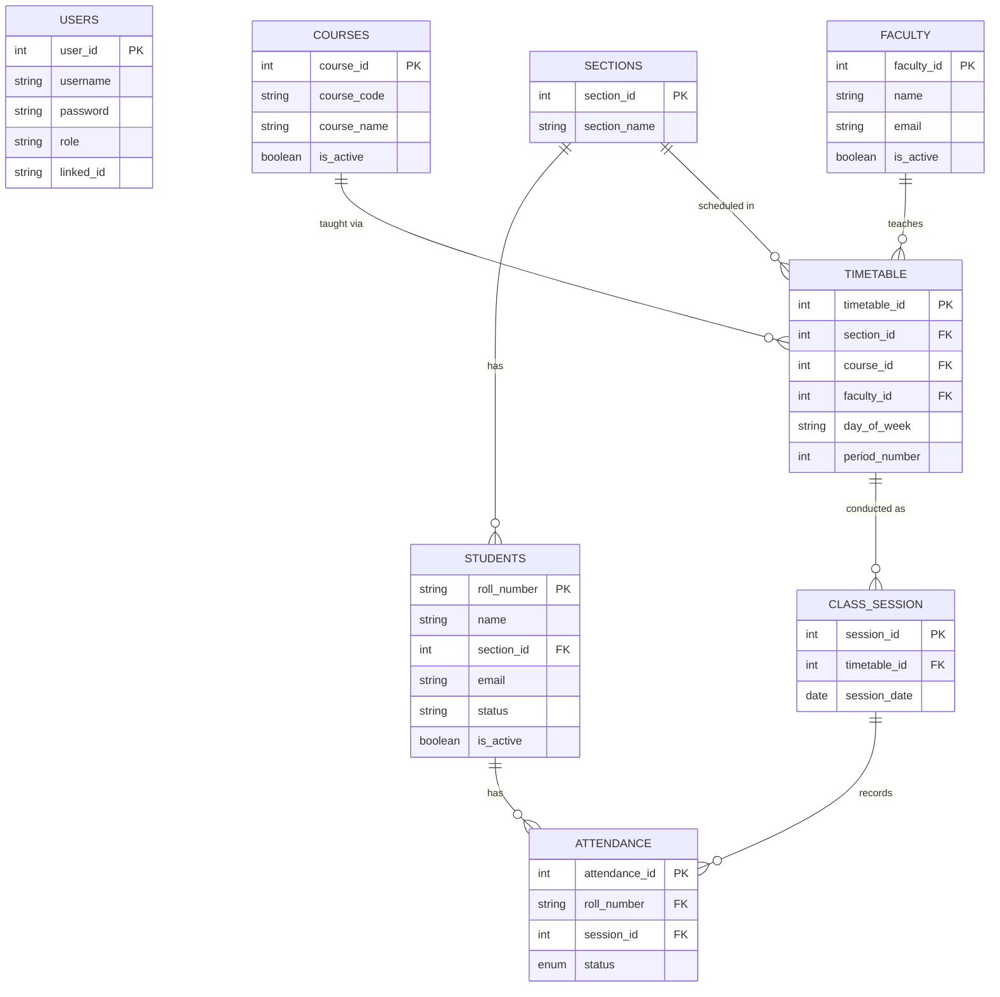

# Database Design & ER Diagram

## Schema Overview

The database (`student_attendance_db`) contains **7 tables** that together support multi-section, multi-faculty, period-level attendance tracking.

| Table | Purpose |
|---|---|
| `users` | Authentication — stores credentials and role for every login |
| `sections` | Class sections (e.g., CSE-A, CSE-B) |
| `courses` | Academic courses; supports soft-delete via `is_active` |
| `faculty` | Faculty members; supports soft-delete via `is_active` |
| `students` | Student records linked to a section; supports soft-delete |
| `timetable` | Scheduled slots: section × course × faculty × day × period |
| `class_session` | A timetable slot conducted on a specific date |
| `attendance` | PRESENT / ABSENT record per student per session |

---

## Entity Relationship Diagram

---

## Key Relationships

### Students → Attendance (One-to-Many)
`roll_number` in `attendance` is a FK to `students`. One student has many attendance records across sessions.

### Timetable → Class Session (One-to-Many)
A timetable slot (e.g., Monday Period 2, CSE-A, Data Structures) can be conducted on multiple dates. Each date creates one `class_session` row.

### Class Session → Attendance (One-to-Many)
For each session, every student in the section gets one `attendance` row. A `UNIQUE KEY (roll_number, session_id)` prevents duplicates; `ON DUPLICATE KEY UPDATE` allows corrections.

---

## Soft Delete
Courses, faculty, and students use an `is_active` boolean column. Deleting sets `is_active = FALSE`; all queries filter on `is_active = TRUE`. This preserves historical attendance data.
